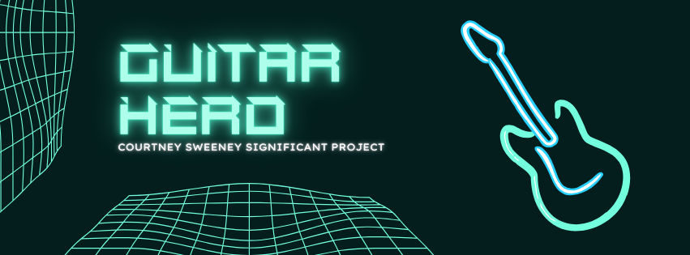

# Guitar Hero
This is the repository for a Guitar Hero game that can be played on the terminal. My code is included here along with a CMake text file. Unfortunately, the audio files that I used with this game are too big to be uploaded here. 

Visit [this link](images/) to view a collection of images from my project. 

## Download Project

Copy and execute both of these commands in the terminal: 

```sh
brew install ncurses sfml
```

```sh
git clone https://github.com/courtneygrace40/guitar-hero.git
```

### Compilation 

Navigate to the correct folder in the terminal and execute both commands: 

```sh
g++ -std=c++11 -I/opt/homebrew/Cellar/sfml/2.6.2/include main.cpp -o main -L/opt/homebrew/Cellar/sfml/2.6.2/lib -lsfml-audio -lsfml-system -lncurses
```
```sh
./main
```

Once the “./main” is entered, the game begins. 

## Classes

### The Note Class

The ```Note``` class has 4 classes that inherit from it: **aNote, sNote, dNote, and fNote**. 

The ```Note``` class has the following attributes (listed with their data type):
1. ```int colorText```
2. ```int colorBack```
3. ```int length```
4. ```int column```
5. ```char key```
6. ```WINDOW * win noteWin```

I hardcoded values for the attributes in each of the child classes to simplify the production of notes. 

### The Song Class 

Another object that I created was the ```Song``` class, which is mostly used in the song selection process. 

The ```Song``` class has the following attributes (listed with their data type):
1. ```int songNum```
2. ```string songName```
3. ```string artistName```
4. ```vector <Note> songNotes```
5. ```string musicPath```
6. ```int speed```


## Making A User Interface

To make my game a playable user interface, I used the **ncurses library**. This library allows for the **manipulation of the terminal** and gets user input from the keyboard. I used this library to create multiple windows where different things can happen simultaneously or based on the window that is used. I created a large window to contain the “strings” with smaller windows to contain the “notes”. Then, I used a loop to draw the lines using characters. Because the lines are created with characters, it was easy to animate notes on these strings. I wrote code to replace the characters over and over again at a certain speed to give the illusion that the note was moving.   

Once I had created the ability to animate the notes, I wrote a function to take in the note key and length and animate it based on that. This is a relatively long function, but it does successfully animate the notes based on the length, key, and speed of the song.   

## Transforming Animations Into A Game

One of the most crucial aspects of turning this from just a series of animations into a game was having the **user interact with the animation**. I created a function to **track which key the user is pressing**. While the user is holding a certain key, the “string” is highlighted. When they release it, the highlight ends. 

Once I had written this function, the next step to complete user interaction was to get the timing of the user compared with the computer. To do this, I used **timestamps and pointers**. I got the timestamps from a few different functions, but I changed the value of a variable in main using pointers. Then, I retrieved these values in a separate function also using the pointer. I did this to get values from different threads simultaneously. There would have been no correct spot to do a function call since the animations and the user input are all happening at the same time in different spots.   

### Threads Library 

To get the user input functions to interact at the same time as the animation functions, I used the **threads library**. The threads library allows for concurrency in C++ programming. I created thread objects to use the threads library. These objects take in function calls and function arguments. Then, to make sure that all of the threads stop simultaneously, I used ```.join()``` on all of the threads.   

Here are the four threads that concurrently run in my program:

```cpp
thread animationThread1(animationThread, win, notes, timerPoints, threadFinishPtr, scorePtr, currentNotePtr, song.speed);
thread userInputThread1(userInputThread, windows, win, timerPoints, scorePtr, threadFinishPtr, currentNotePtr);
thread musicThread(streamMusic, song.musicPath, isPlayingPtr);
thread songNameThread(songDisplayThread, song);
```

### SFML Library 

I used the **SFML library** to play music as the user plays the game. Since my game is Guitar Hero, the background music is a crucial part of the game. I uploaded two songs as “wav” files that play based on the user’s choice. The songs begin when the user enters the actual gameplay and end once the gameplay is finished. 


## Visit My C++ Tutorial

All of the sources I used to help code this project are in my [C++ tutorial](https://github.com/courtneygrace40/CS-330-Project). I also included a “Libraries” section to document where I found my information on the various libraries I used. 
 

